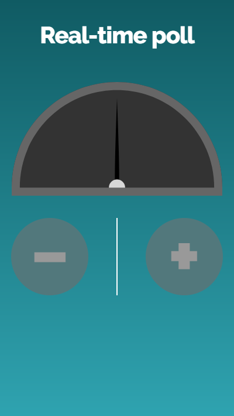
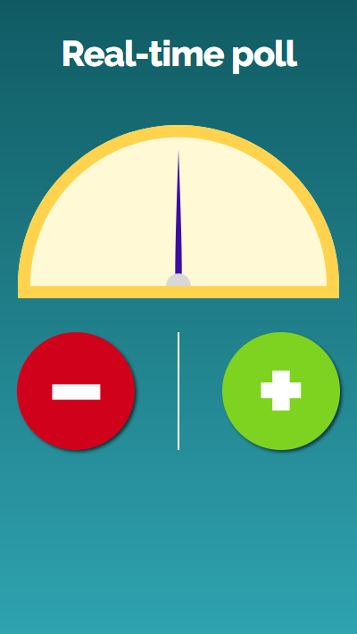

# Realtime poll
This is a tech demo that was prepared for an SBS dev catch-up presentation on websockets and their reaching maturity in [modern browsers](http://caniuse.com/#feat=websockets). [Socket.io](https://socket.io) makes socket implementation trivially easy, implementing JavaScript's [event model](https://developer.mozilla.org/en-US/docs/Learn/JavaScript/Building_blocks/Events) for more or less seamless integration for architecturally-disconnected web-apps.

## Demo setup
There are two parts to this tech demo: the _voting interface_ for vote submission, and the _ballot interface_ for administration.

### Voting interface
The voting interface has two states based on the connectivity of the server. If a connection cannot be made, the disabled state displays (_Figure 1_).


*Figure 1: The voting interface disabled*


*Figure 2: The voting interface enabled*

There are three files that reference the socket server, within the constant `VOTE_API_SERVER`:

 * `src/components/VotingApp/VotingApp.js`
 * `src/components/ClientGraph/ClientGraph.js`
 * `src/components/Admin/Ballot.js`

### Project setup
This is an implementation of [`create-react-act` ](https://github.com/facebookincubator/create-react-app), for which the [script commands](https://github.com/facebookincubator/create-react-app/blob/master/packages/react-scripts/template/README.md#available-scripts) apply.

#### 1. Clone this client repo
Clone this repo by running:

```
git clone https://github.com/kashisau/rtpoll.git
```

#### 2. Update the server address in the following files:
The variable `VOTE_API_SERVER` will need to be updated to the address that the socket server uses. Typically this will be `http://localhost:8000` (note the absence of the trailing `/`).

 * `src/components/VotingApp/VotingApp.js`
 * `src/components/ClientGraph/ClientGraph.js`
 * `src/components/Admin/Ballot.js`

#### 3. Install the requisite packages
Simply run `npm i` within the directory to which you downloaded the repo.

#### 4. Download the server
Into a separate directory, clone the [RTPoll Server](https://github.com/kashisau/rtpoll-server):

```
git clone https://github.com/kashisau/rtpoll-server.git
```

#### 5. Run the server
Within the `rtpoll-server` directory, run `node server.js` to run the socket server.

#### 6. Run the client interface
Within the `rtpoll` directory, run `npm start`.

# License

Copyright (c) 2017 Kashi Samaraweera

Permission is hereby granted, free of charge, to any person obtaining a copy
of this software and associated documentation files (the "Software"), to deal
in the Software without restriction, including without limitation the rights
to use, copy, modify, merge, publish, distribute, sublicense, and/or sell
copies of the Software, and to permit persons to whom the Software is
furnished to do so, subject to the following conditions:

The above copyright notice and this permission notice shall be included in all
copies or substantial portions of the Software.

THE SOFTWARE IS PROVIDED "AS IS", WITHOUT WARRANTY OF ANY KIND, EXPRESS OR
IMPLIED, INCLUDING BUT NOT LIMITED TO THE WARRANTIES OF MERCHANTABILITY,
FITNESS FOR A PARTICULAR PURPOSE AND NONINFRINGEMENT. IN NO EVENT SHALL THE
AUTHORS OR COPYRIGHT HOLDERS BE LIABLE FOR ANY CLAIM, DAMAGES OR OTHER
LIABILITY, WHETHER IN AN ACTION OF CONTRACT, TORT OR OTHERWISE, ARISING FROM,
OUT OF OR IN CONNECTION WITH THE SOFTWARE OR THE USE OR OTHER DEALINGS IN THE
SOFTWARE.